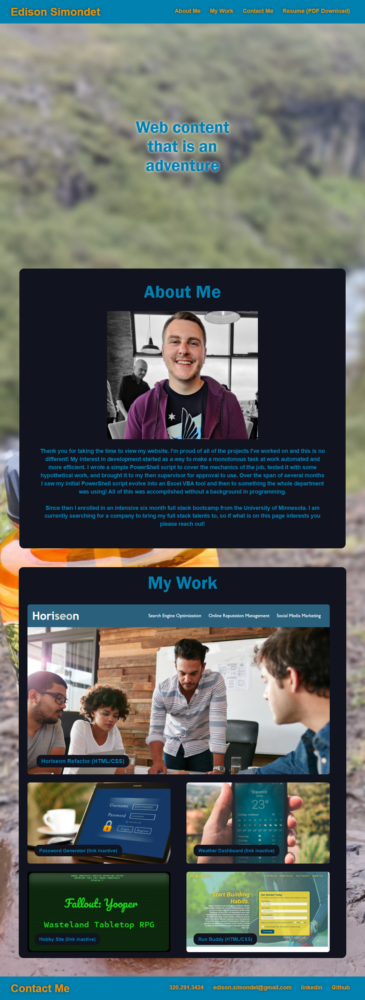

# Edison Simondet Portfolio

## Purpose
A website to showcase my programing prowess

## Description
In this project advanced techniques were taken to highlight HTML and CSS understanding, including:
* Flex-box styled layouts to encourage a responsive environment
* Media queries designed to support a wide range of platforms
* Hover attributes on both internal and external links
* Color pallete and design choices that show individual thought
* A showcase section of various ongoing and upcoming projects

## Built With
* HTML
* CSS

## Website
You can view the live deployment [HERE](https://esimondet.github.io/challenge-two-professional-portfolio/)

## Screenshot of landing page

## Contribution
Created by Edison Simondet
